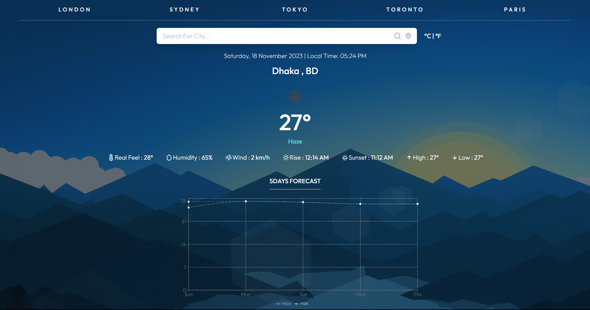
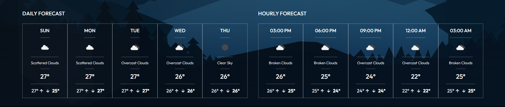

# Weather App

## Description

The Weather App is a simple application that provides current weather conditions and forecasts for different locations. It uses the OpenWeatherMap API to fetch weather data and displays it in a user-friendly interface.

## Live Link

- [Live Preview](https://react-weather-app-open-weather.netlify.app/) Live Preview.

## Features

- **Current Weather:** View real-time weather conditions for a specific location, including temperature, humidity, wind speed, and more.

- **Forecast:** Get a 5-day weather forecast, including hourly and daily predictions.

- **Responsive Design:** The app is designed to work seamlessly on various devices, ensuring a great user experience on desktops, tablets, and smartphones.

## Screenshots

Include screenshots or gifs showcasing different aspects of your app. For example:

## Technologies Used

- React: JavaScript library for building user interfaces.
- Recharts: Used for data visualization in line chart.
- Luxon: Used for Date and Time format.
- React-Tostify: Used for Alart.
- Tailwind css: Used for styling and responsive
- OpenWeatherMap API: Used to retrieve weather data.

## Getting Started

### Prerequisites

- Node.js installed on your machine.

### Installation

1. Clone the repository: `git clone https://github.com/imranahmmed/weather-app.git`
2. Navigate to the project directory: `cd weather-app`
3. Install dependencies: `npm install`
4. Run the app: `npm start`

## Usage

- Open the app in your browser.
- Enter the location for which you want to check the weather.
- Explore the current conditions and forecast.

## API Key

This app uses the OpenWeatherMap API. To run the app, you'll need to [sign up for an API key](https://openweathermap.org/appid) and replace `YOUR_API_KEY` in the code with your actual API key.

## Acknowledgments
- [OpenWeatherMap](https://openweathermap.org/) for providing the weather data.

